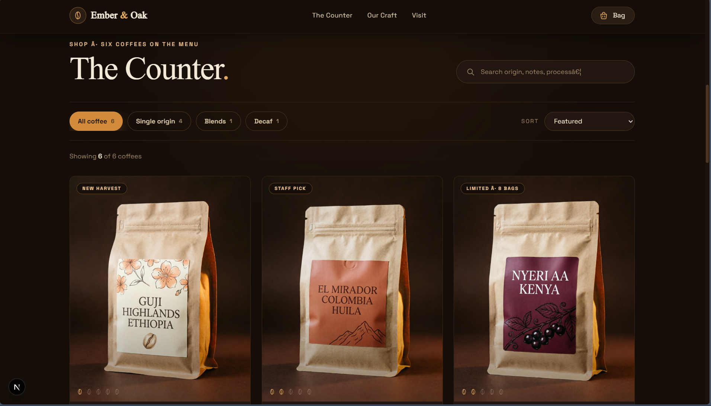

# 🚀 Ember-Oak - Specialty Coffee E-commerce App
> **Specialty coffee e-commerce app "Ember & Oak" complete: 6 products, live search, category filters + sorting, product detail modal**

<p align="center">
  
</p>

---

## 🌟 Overview

**Ember-Oak** is a high-performance e-commerce platform designed to provide a seamless user experience for specialty coffee enthusiasts. The application boasts a modern tech stack, ensuring fast and efficient performance. With its clean architectural principles, Ember-Oak streamlines project workflows and data management into one solution.




### Why Ember-Oak?

* **Unified Workspace:** Ember-Oak streamlines the e-commerce experience, providing users with an intuitive interface to browse and purchase specialty coffee products.
* **Modern Stack:** Built on modern infrastructure, including Node.js, TypeScript, React, Next.js, and Tailwind CSS, Ember-Oak ensures a fast and efficient user experience.
* **Automated Data Flow:** The application handles complex background logic and real-time processing seamlessly, providing a smooth user experience.

Ember-Oak's architecture is designed with scalability and maintainability in mind. The use of a modern tech stack ensures that the application can handle a high volume of traffic and user interactions. The application's design choices, such as the use of React and Next.js, provide a flexible and customizable platform for developers to build upon.

The development of Ember-Oak is focused on providing a high-quality user experience. The application's features, such as live search and category filters, are designed to make it easy for users to find and purchase their favorite specialty coffee products. The use of Tailwind CSS ensures a visually appealing and consistent design throughout the application.

---

## ✨ Features

### 🎯 Core Features
* **Live Search:** Quickly find your favorite specialty coffee products with our live search feature.
* **Category Filters:** Easily browse products by category, making it simple to find what you're looking for.
* **Product Detail Modal:** View detailed product information, including images and descriptions, in a convenient modal window.

### 📦 Storage & Architecture
* **Next.js:** Built on the popular Next.js framework, ensuring fast and efficient server-side rendering.
* **React:** Utilizes React for building reusable UI components, making it easy to maintain and update the application.

### 🎨 UI/UX
* **Tailwind CSS:** Styled with Tailwind CSS, providing a consistent and visually appealing design throughout the application.

### 🔧 Technical Highlights
* **TypeScript:** Built with TypeScript, ensuring type safety and maintainability.
* **Node.js:** Powered by Node.js, providing a fast and efficient runtime environment.

---

## 🛠 Technologies Used

* Node.js
* TypeScript
* React
* Next.js
* Tailwind CSS

---

## 📦 Installation

Clone the repository:
```bash
git clone https://github.com/DarkFeed2005/Ember-Oak.git
cd Ember-Oak
```

Install dependencies:
```bash
pnpm install
```

---

## 🚀 Usage

Start the development server:
```bash
pnpm dev
```

---

## 📁 Project Structure

```text
├── .idea
│   ├── .gitignore
│   ├── Ember-Oak.iml
│   ├── go.imports.xml
│   ├── misc.xml
│   ├── modules.xml
│   └── vcs.xml
├── app
│   ├── globals.css
│   ├── layout.tsx
│   └── page.tsx
├── LICENSE
├── next.config.ts
├── package-lock.json
├── package.json
├── postcss.config.mjs
├── public
│   ├── coffee
│   │   ├── Cerrado Natural.png
│   │   ├── El Mirador.png
│   │   ├── Guji Highlands.png
│   │   ├── HERO_IMAGE.png
│   │   ├── Night Owl Espresso.png
│   │   ├── Nyeri AA.png
│   │   └── Sugarcane Decaf.png
│   └── ...
├── README.md
├── src
│   ├── Assets
│   │   ├── Cerrado Natural.png
│   │   ├── El Mirador.png
│   │   └── ...
│   └── ...
└── ...
```

---

## 🤝 Contributing

1. Fork the Project
2. Create your Feature Branch (`git checkout -b feature/AmazingFeature`)
3. Commit your Changes (`git commit -m 'Add some AmazingFeature'`)
4. Push to the Branch (`git push origin feature/AmazingFeature`)
5. Open a Pull Request

---

## 👨‍💻 Author

GitHub: DarkFeed2005

[](https://opensource.org/licenses/MIT)
[](https://www.typescriptlang.org/)
[](https://github.com/DarkFeed2005/Ember-Oak)
[](https://github.com/DarkFeed2005/Ember-Oak)
